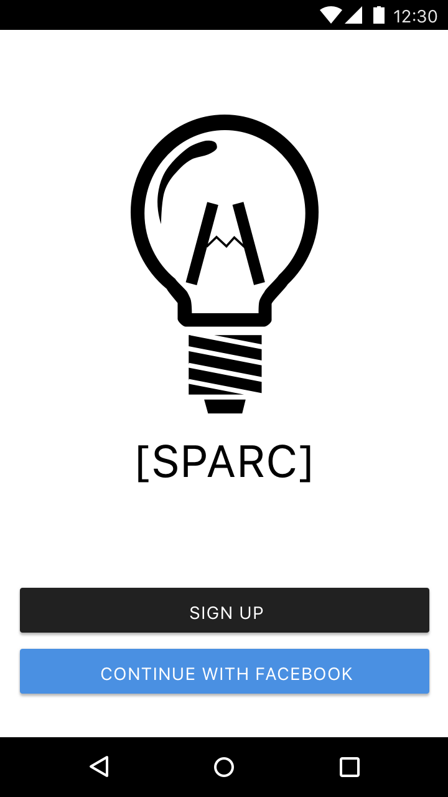
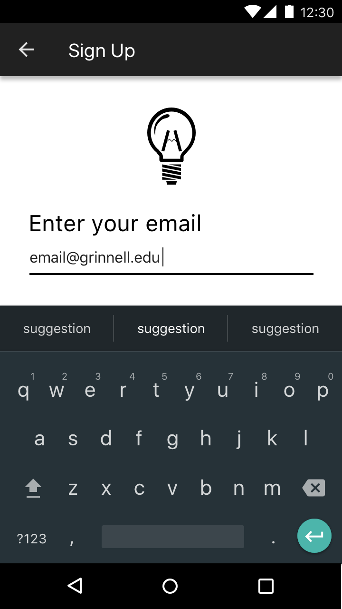

# AppDev Android Training - 11/9/16
Have any questions? Feel free to ask [Larry Asante](mailto:boatenga17@grinnell.edu) or [Mattori Birnbaum](mailto:birnbaum@grinnell.edu), via email or in person.

## TOC
* [Prerequisites](#prereqs)
* [Homework](#hw)
* [Mockups](#mockups)

<a name="prereqs">
### Prerequisites
</a>

So far, we've learned about Activities and Intents. Let's tie it all up!

For this assignment, you will need to be able to produce new Activities with custom content, respond to buttons, read data from widgets, and start new Activities with extra data/parameters. If you are unclear on any of this, look at previous lessons and the [Android API Reference](https://developer.android.com/reference/packages.html).

<a name="hw">
### Homework
</a>

Implement an application that features a login screen and subsequent greeting screen based off of their login. The login screen should ask for their username and password and then pass that information on to the greeting screen, which can simply greet the user by their username (here's a hint: look into [EditText](https://developer.android.com/reference/android/widget/EditText.html)). Once you complete that, try to add a registration feature. When the user tries to login with an invalid combination they should get a response -- a `Toast` works.

I realize there is a login Activity template in Android Studio; do not use it. Not only does it defeat the purpose of learning, but it also contains a lot of junk and unnecessary content. It is only one of many different ways to make a login screen for Android.

This is going to be a bit different than what we've done in the past. This is a real project that you will be building upon in the future, and it will culminate in a complete, usable app. You don't need to worry about making it look pretty yet, but if you have extra time and want to play around feel free to add some polish or bonus features!

<a name="mockups">
### Mockups
</a>

When you are developing an app for AppDev, you will be given mockups from designers of what the app should look like. This includes all screens and panels, including multiple mockups for side panels and settings. Here are a couple mockups for AppDev's Publications app for SPARC, which is still a work in progress. You can use them as a model for your own login screens. The only caveat is that you should not try to duplicate the logo.

